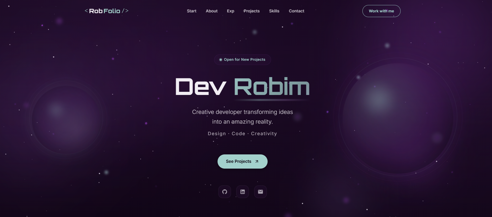
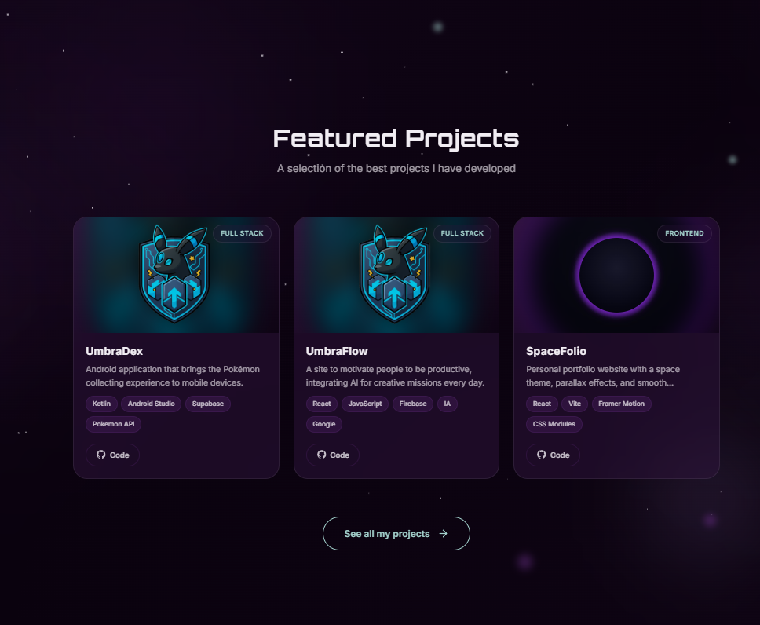
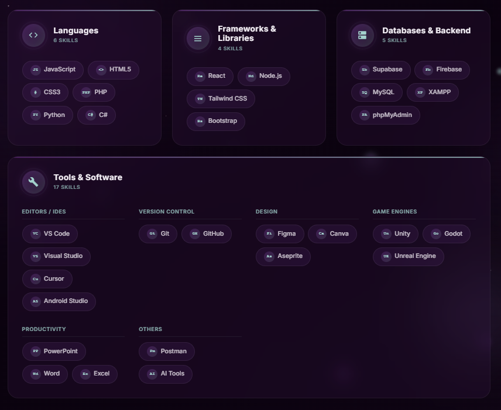

# SpaceFolio

Personal portfolio built with React + Vite, with a space-themed visual identity and smooth interactions.

## Live Demo

Preview the project here: [https://robfolio-ten.vercel.app/](https://robfolio-ten.vercel.app/)

## Tech Stack

- React 19
- Vite 7
- React Router 7
- Framer Motion
- CSS Modules

## Screenshots

<p align="center">
	
</p>

<div align="center" style="display: flex; justify-content: center; gap: 10px; flex-wrap: nowrap; width: 100%;">
	
	
</div>

<p align="center" style="margin-top: 20px;">
	
</p>

## Project Structure

```text
.
├─ data/                  # Portfolio data content (projects, skills, etc.)
└─ front/                 # Frontend app
	 ├─ public/             # Static assets
	 ├─ src/                # App source code
	 ├─ package.json
	 └─ vite.config.js
```

## Local Setup

Requirements:

- Node.js 20+ (recommended)
- npm 10+

Install and run:

```bash
cd front
npm install
npm run dev
```

App runs locally on the Vite dev server URL (usually `http://localhost:5173`).

## Scripts

From `front/`:

- `npm run dev` - start development server
- `npm run build` - create production build in `front/dist`
- `npm run preview` - preview production build locally
- `npm run lint` - run ESLint

## Pre-Launch Checklist

Run from `front/`:

```bash
npm run lint
npm run build
npm audit --audit-level=moderate
```

## Deployment Notes (Important)

This app uses `BrowserRouter` (`/projects` route). Your host must rewrite all unknown routes to `index.html`, otherwise direct refresh on `/projects` may return `404`.

### Netlify

Add a `_redirects` file with:

```text
/* /index.html 200
```

### Vercel

Use `vercel.json` rewrites:

```json
{
	"rewrites": [{ "source": "/(.*)", "destination": "/index.html" }]
}
```

### Nginx

```nginx
location / {
	try_files $uri /index.html;
}
```

## Security Notes

- No backend secrets are stored in source.
- External links opened in new tabs use `rel="noopener noreferrer"`.
- Keep dependencies updated regularly (`npm audit`, `npm update`, CI checks).

## Content Editing

Portfolio data is centralized in:

- `data/projects.js`
- `data/professional.js`
- `data/skills.js`
- `data/achievements.js`

Update these files to change showcased information without touching component logic.